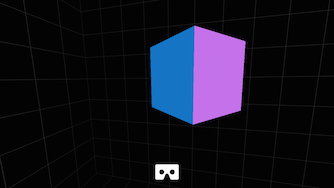
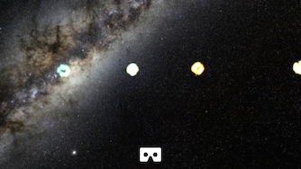
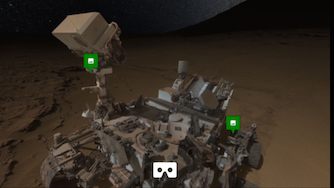
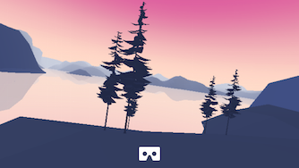

# WebVR Boilerplate

A [THREE.js][three]-based starting point for VR experiences that work well in
both Google Cardboard and other VR headsets. Also provides a fallback for
experiencing the same content without requiring a VR device.

This project relies heavily on the [webvr-polyfill][polyfill] to provide VR
support even if the WebVR spec is not implemented.

[three]: http://threejs.org/
[polyfill]: https://github.com/borismus/webvr-polyfill

## Projects that use the boilerplate

[][wb]
[][mm]
[][evr]
[][s]

[wb]: http://borismus.github.io/webvr-boilerplate/
[mm]: http://borismus.github.io/moving-music/
[evr]: #
[s]: http://borismus.github.io/sechelt/

## Getting started

The easiest way to start is to fork this repository or copy its contents into a
new directory.

Alternatively, you can start from scratch. The key parts that the boilerplate
provides are:

1. Include webvr-polyfill.js in your project.
2. Include webvr-manager.js and instantiate a WebVRManager object,
   passing in your VREffect instance as well as THREE.js' WebGLRenderer (from
   the THREE.js effect library) as first argument.

For example,

    var effect = new THREE.VREffect(renderer);
    var manager = new WebVRManager(renderer, effect);

The manager handles going in and out of VR mode. Instead of calling
`renderer.render()` or `effect.render()`, you call `manager.render()`, which
renders in monocular view by default, or side-by-side binocular view when in VR
mode.

The polyfill and boilerplate are also available via bower. Easy install:

    bower install webvr-boilerplate

## Features and known issues

Features:

- Enter and exit VR mode (in WebVR and WebVR polyfill compatible environments).
- Immersive fullscreen, orientation locking and sleep prevention.
- Distortion correction, enabled in iOS only. 
- High quality head tracking with motion prediction thanks to webvr-polyfill.

Bugs and known issues:

- Proper distortion correction for Android. This requires knowing physical
  locations of lenses, which requires knowing device's DPI, which is hard in
  general. It's easier in iOS because there are relatively few iPhone models.
- Wake lock for Android currently relies on a hack in which a hidden video is
  played on repeat in the background. This causes big WebGL performance issues,
  so has been disabled. This will be resolved when the official wakelock API
  lands: <http://crbug.com/257511>

## Configuration 

All configuration is done through the global `window.WebVRConfig` object.

    WebVRConfig = {
      // Forces distortion in VR mode.
      //FORCE_DISTORTION: true, // Default: false.
      // Prevents distortion in VR mode, also on iOS.
      //PREVENT_DISTORTION: true, // Default: false.
      // Override the distortion background color.
      //DISTORTION_BGCOLOR: {x: 1, y: 0, z: 0, w: 1}, // Default: (0,0,0,1).
    };

## Thanks

- [Dmitry Kovalev][dk] for implementing [lens distortion correction][distortion].
- [Brandon Jones][bj] and [Vladimir Vukicevic][vv] for their work on the [WebVR
  spec][spec]
- [Diego Marcos][dm] for VREffect and VRControls.
- [Ricardo Cabello][doob] for THREE.js.

[dk]: https://plus.google.com/+DmitryKovalev1
[distortion]: https://github.com/borismus/webvr-boilerplate/blob/master/src/cardboard-distorter.js
[bj]: https://twitter.com/tojiro
[vv]: https://twitter.com/vvuk
[spec]: http://mozvr.github.io/webvr-spec/webvr.html
[dm]: https://twitter.com/dmarcos
[doob]: https://twitter.com/mrdoob
